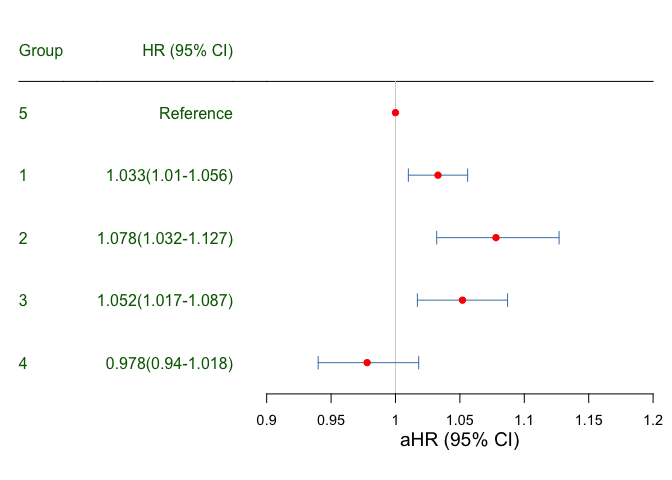

## Source code to plot a Forest Plot

### Import necessary packages

    library(ggplot2)
    library(plyr)
    library(lattice)
    library(forestplot)

    ## Loading required package: grid

    ## Loading required package: magrittr

    ## Loading required package: checkmate

### Import data

    data<-read.csv("demo.csv")
    print(data)

    ##   Group              VALUE    HR LOWER UPPER X X.1 X.2
    ## 1 Group        HR (95% CI)    NA    NA    NA          
    ## 2     5          Reference 1.000 1.000 1.000          
    ## 3     1  1.033(1.01-1.056) 1.033 1.010 1.056 (   )   -
    ## 4     2 1.078(1.032-1.127) 1.078 1.032 1.127 (   )   -
    ## 5     3 1.052(1.017-1.087) 1.052 1.017 1.087 (   )   -
    ## 6     4  0.978(0.94-1.018) 0.978 0.940 1.018 (   )   -

### Assign values from specific columns for your forest plot

    cochrane_from_rmeta <- 
      structure(list(
        mean = c(data$HR),
        lower = c(data$LOWER),
        upper = c(data$UPPER)),
        .Names = c("mean", "lower", "upper"), 
        row.names = c(NA, -(length(data$HR))), 
        class = "data.frame")

    tabletext<-cbind(data$Group, data$VALUE)

### Set the format parameters

-   xlab\_text:Set text content of x label.
-   xrange(a, b, by = c) : here a is the lower limit, b is the upper
    limit, and c is the interval of of x axis.
-   fontsize: set the size of the fonts in the plot.
-   boxsize: set the circle size which indecates the mean value of the
    plot.

<!-- -->

    #Setting parameters
    xlab_text = "aHR (95% CI)" #Set x label
    xrange = seq(0.9, 1.2, by=0.05)

    #Set fontsizes
    fontsize_lab = 1.0 #label
    fontsize_xlab = 1.2 #label of x axis
    fontsize_ticks = 0.9 #ticks of x axis

    #Set box size
    boxsize = 0.1

    #Set colors
    boxcolor = "red"
    textcolor = "black"
    linecolor = "steelblue" #for the line of each sample
    labelcolor = "darkgreen" #color of label text
    axiscolor = "green"
    colorlabel = "orange"
    hrelcolor = "black"

### Visualization

    #Generate forestplot
    forestplot(tabletext,
               line.margin =0.0000001,
               cochrane_from_rmeta,
               new_page = TRUE,
               xlog=FALSE,
               boxsize=boxsize,
               col.lab=colorlabel,
               #is.summary=c(TRUE,TRUE,rep(FALSE,8),TRUE,rep(FALSE,7),TRUE,rep(FALSE,6),TRUE,rep(FALSE,5),TRUE,rep(FALSE,4),TRUE,rep(FALSE,3),TRUE,rep(FALSE,2)),
               is.summary = rep(FALSE, length(data$HR)), #Set which one is summary
               #xlog=TRUE,
               xlab=xlab_text,
               txt_gp = fpTxtGp(label =gpar(fontfamily = "Arial", cex=fontsize_lab,col=labelcolor),
                                xlab = gpar(fontfamily = "Arial", cex=fontsize_xlab,col=axiscolor),
                                ticks = gpar(fontfamily = "Arial", cex=fontsize_ticks)),
               col=fpColors(box=boxcolor,line=linecolor,text=textcolor),
               xticks = xrange,
               zero = 1,
               fn.ci_norm = fpDrawCircleCI, #Change the mark to circle
               ci.vertices = TRUE,
               ci.vertices.height = 0.1,
               hrzl_lines = list("2" = gpar( col = hrelcolor)))

